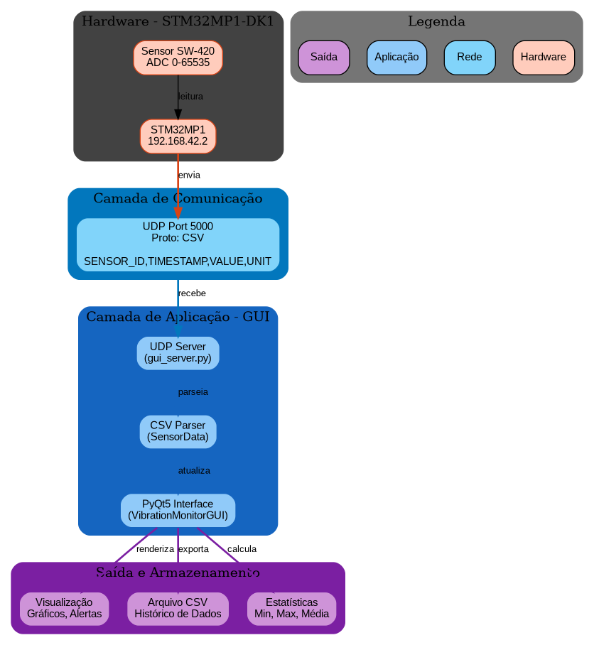
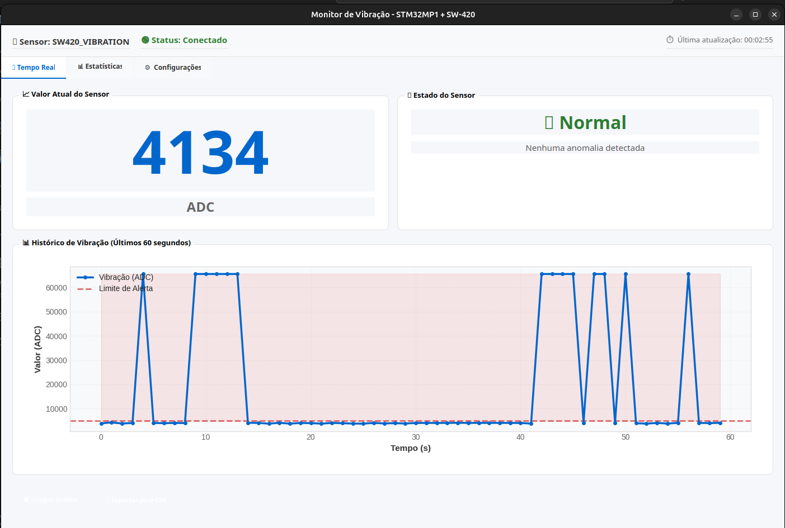
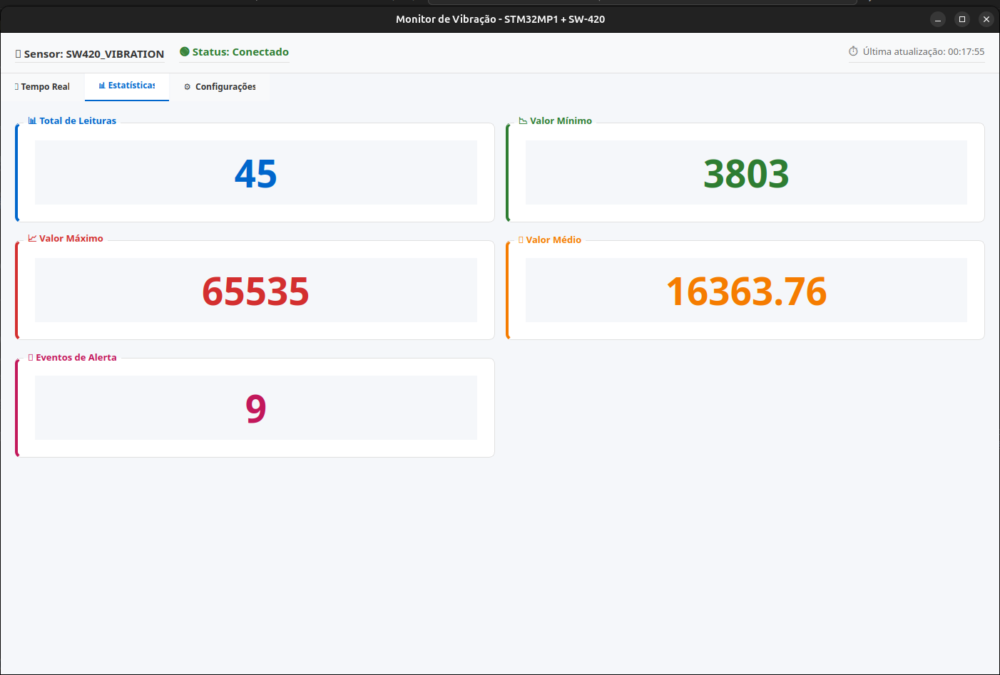
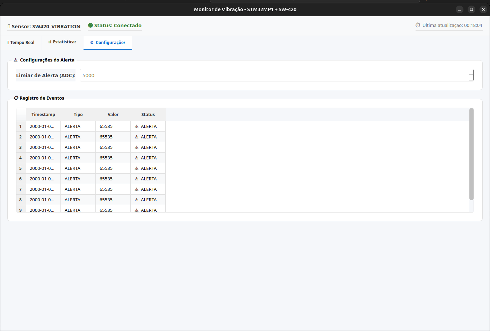
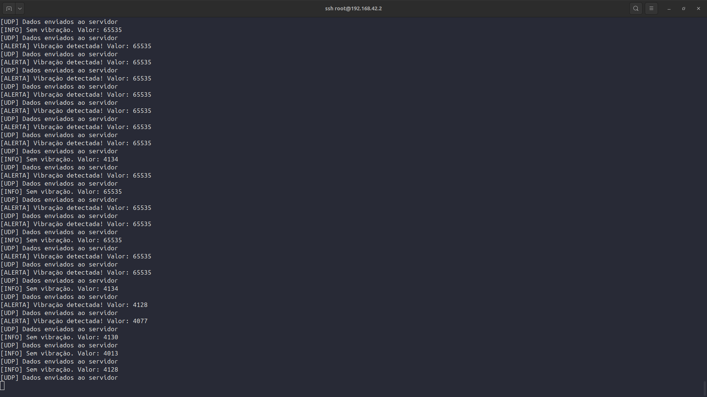
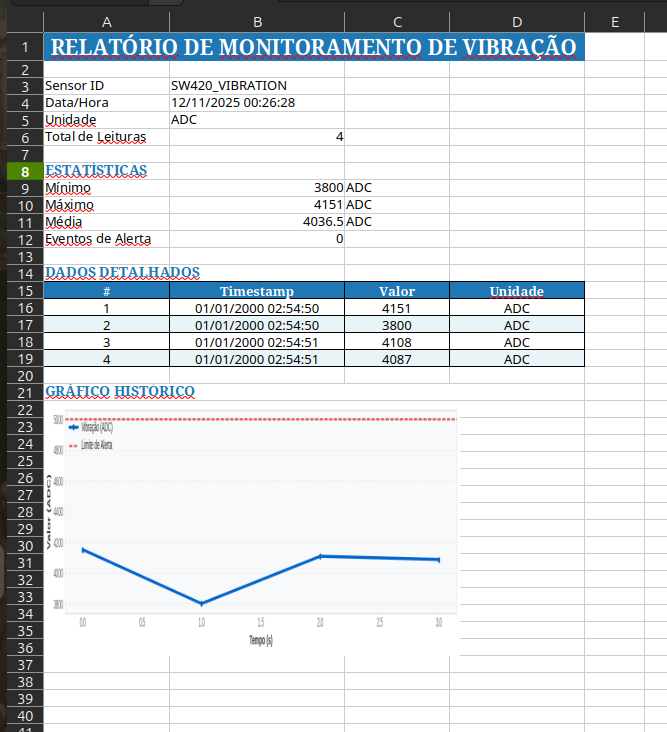

# Interface Gráfica de Monitoramento – Sensor de Vibração STM32MP1

## 1. Introdução

Este projeto implementa uma interface gráfica desenvolvida em **Python (PyQt5)** para monitoramento em tempo real do **sensor de vibração SW-420**, conectado ao kit **STM32MP1-DK1**.

O sistema foi projetado para exibir os valores capturados pelo sensor, gerar alertas visuais em caso de vibração excessiva e armazenar os dados para análise posterior.  
A aplicação é voltada para uso educacional, demonstrações de sistemas embarcados e aplicações industriais de detecção de vibração.

---

## 2. Visão Geral do Sistema

A figura abaixo mostra o fluxo completo de comunicação entre o kit STM32MP1 e o computador que executa a interface.



1. O **sensor SW-420** detecta vibrações e envia o valor ao microcontrolador.  
2. O **STM32MP1** formata a leitura e envia via **UDP** ao computador host.  
3. O computador executa o software **Vibration Monitor GUI**, que:
   - Recebe as mensagens UDP.
   - Atualiza o valor em tempo real.
   - Exibe gráficos e estatísticas.
   - Gera alertas e permite exportação de dados.

---

## 3. Estrutura do Projeto

```
Vibration-Monitor-GUI/
├── gui_server.py             # Servidor UDP e manipulação de dados
├── vibration_monitor_gui.py  # Interface principal em PyQt5
├── requirements.txt          # Dependências do ambiente Python
└── README.md                 # Documentação do projeto
```

### Componentes Principais

**gui_server.py**
- Contém o servidor UDP responsável por receber e armazenar as mensagens enviadas pelo kit.
- Classes:
  - `SensorData`: estrutura para cada leitura (ID, timestamp, valor e unidade).
  - `UDPServer`: gerencia a comunicação e exporta dados para CSV.

**vibration_monitor_gui.py**
- Implementa a interface gráfica principal (classe `VibrationMonitorGUI`), organizada em três abas:
  1. Tempo Real
  2. Estatísticas
  3. Configurações

---

## 4. Interface Gráfica

A aplicação apresenta uma interface intuitiva e modular, permitindo acompanhar as leituras do sensor e configurar limites de alerta em tempo real.

### 4.1 Aba “Tempo Real” – Monitoramento Contínuo

Nesta aba, o usuário acompanha o valor atual do sensor e o gráfico dos últimos 60 segundos.



**Recursos:**
- Exibição do valor atual com destaque visual.
- Gráfico histórico atualizado continuamente com **timestamps no eixo X** (em Brasília).
- Indicador de status:
  - **Verde:** condição normal.
  - **Vermelho:** vibração acima do limite.
- Botões de ação:
  - **Limpar Gráfico** – limpa o histórico visual.
  - **Exportar CSV** – salva os dados coletados em arquivo.
  - **Exportar para PDF** – gera relatório visual com gráfico.
  - **Exportar para XLSX** – cria planilha com dados e gráfico.

---

### 4.1.1 Gráfico Histórico com Timestamps

O gráfico exibe os últimos 60 segundos de dados com **timestamps em tempo real (Brasília)** no eixo X:

**Características:**
- **Eixo X:** Timestamps em formato HH:MM:SS (Brasília)
- **Eixo Y:** Valores de vibração em ADC (0-65535)
- **Linha azul:** Dados de vibração em tempo real
- **Linha vermelha tracejada:** Limite de alerta (threshold)
- **Área vermelha:** Região acima do limite (visual alert)
- **Marcadores:** Pontos de dados individuais para melhor visualização

**Interpolação de Timestamps:**
- O gráfico mostra aproximadamente **5 timestamps** distribuídos uniformemente
- O último timestamp sempre é exibido
- Rotação de 45° para melhor legibilidade
- Atualização automática a cada dados recebidos

---

### 4.2 Aba "Estatísticas" – Análise de Dados

Permite visualizar informações consolidadas das leituras recebidas.



**Campos exibidos:**
- Total de leituras recebidas.
- Valor mínimo, máximo e médio.
- Número total de eventos de alerta detectados.

---

### 4.3 Aba “Configurações” – Parâmetros e Limiar de Alerta

Nesta aba é possível ajustar, em tempo real, o valor de limiar (threshold) do sensor e visualizar o registro de eventos.



**Recursos:**
- Campo para alteração do limite de alerta (ADC).  
- Log com histórico de eventos, contendo data, hora e valor.  
- Alterações aplicadas imediatamente no monitoramento.

---

## 5. Comunicação e Protocolo

O kit STM32MP1 envia os dados em formato **CSV**, via protocolo **UDP**, conforme estrutura abaixo:

```csv
SENSOR_ID,TIMESTAMP,VALUE,UNIT
```

### Exemplo:
```csv
SW420_GRUPO_10,2025-11-04T15:30:45,2450,ADC
```

| Campo | Tipo | Descrição | Exemplo |
|-------|------|-----------|---------|
| SENSOR_ID | string | Identificador do sensor | SW420_GRUPO_10 |
| TIMESTAMP | string | Data/hora ISO 8601 | 2025-11-04T15:30:45 |
| VALUE | int | Valor lido do ADC | 2450 |
| UNIT | string | Unidade de medida | ADC |

---

## 6. Fluxo de Operação

O diagrama a seguir ilustra o fluxo de funcionamento entre o kit STM32MP1 e o computador:

```
┌────────────────────┐                ┌──────────────────────────┐
│ STM32MP1-DK1       │                │ PC (Interface PyQt5)     │
│ IP: 192.168.42.2    │                │ IP: 192.168.42.10        │
│                     │                │                          │
│ 1. Inicializa o sensor SW-420        │
│ 2. Cria socket UDP                   │
│ 3. Envia pacotes CSV                 │ ───────────────► │
│ 4. GUI recebe e atualiza interface   │
│ 5. Intervalo de envio: 500 ms        │
└────────────────────┘                └──────────────────────────┘
```

---

## 7. Guia de Instalação e Execução

### 7.1 Requisitos

- **Python 3.6 ou superior**
- Sistema operacional compatível: **Windows, Linux ou macOS**
- Pacotes listados em `requirements.txt`

### 7.2 Instalação das Dependências

```bash
pip install -r requirements.txt
```

Principais bibliotecas utilizadas:
- `PyQt5` – interface gráfica.
- `matplotlib` – geração de gráficos.
- `pandas` – manipulação e exportação de dados.

---

### 7.3 Configuração de Rede

Para que o kit e o computador se comuniquem corretamente, ambos devem estar na mesma sub-rede.

**Endereçamento recomendado:**

| Dispositivo | IP | Máscara |
|--------------|----|----------|
| STM32MP1 | 192.168.42.2 | 255.255.255.0 |
| PC (host) | 192.168.42.10 | 255.255.255.0 |

**Configuração no Windows:**
```
Painel de Controle → Rede e Internet → Adaptador Ethernet → Propriedades → IPv4
```

**Configuração no Linux/macOS:**
```bash
sudo ifconfig eth0 192.168.42.10 netmask 255.255.255.0
```

---

### 7.4 Execução do Programa

Após configurar a rede e instalar as dependências, execute:

```bash
python3 vibration_monitor_gui.py
```

Saída esperada no terminal:



```
[INFO] Servidor UDP iniciado em 192.168.42.10:5000
```

A interface será exibida automaticamente e começará a atualizar assim que o kit enviar os dados via UDP.

---

## 8. Estrutura de Dados Transmitidos

```csv
SW420_VIBRATION,2025-11-04T15:30:45,2450,ADC
```

- **SW420_VIBRATION:** Identificador do sensor.  
- **2025-11-04T15:30:45:** Data/hora ISO 8601.  
- **2450:** Valor de leitura do ADC (0–65535).  
- **ADC:** Unidade de medida.  

---

## 9. Solução de Problemas

### Porta 5000 em uso
**Mensagem:** `Address already in use`  
**Causa:** Outro processo está utilizando a porta UDP 5000.  
**Solução:**
```bash
# Linux/macOS
lsof -i :5000
# Windows
netstat -ano | findstr :5000
```
Finalize o processo e execute novamente o programa.

### Nenhum dado recebido
**Possíveis causas:**
1. O kit não está conectado na mesma rede.  
2. O IP configurado no firmware está incorreto.  
3. O programa de envio não está em execução.  

**Verificação:**
```bash
ping 192.168.42.2
```
Confirme que o IP de destino no firmware é `192.168.42.10`.

### Interface lenta
**Causa:** Histórico de dados muito extenso.
**Solução:** Utilize o botão "Limpar Gráfico" ou reduza o tamanho do buffer em `gui_server.py`.

---

## 10. Exportação de Relatórios

A partir da versão 2.0, a aplicação suporta exportação de dados em múltiplos formatos (CSV, PDF e XLSX), permitindo a geração de relatórios profissionais com estatísticas, gráficos e histórico de leituras.

### 10.1 Formatos Suportados

**CSV (Comma Separated Values)**
- Formato simples e compatível com qualquer ferramenta de análise.
- Contém todas as leituras: sensor_id, timestamp, value, unit.
- Ideal para importação em ferramentas externas (Excel, MATLAB, Python, etc.).

**PDF (Portable Document Format)**
- Relatório visual profissional com:
  - Informações gerais (sensor, data/hora, total de leituras).
  - Estatísticas consolidadas (mín, máx, média, eventos de alerta).
  - Gráfico histórico embutido.
  - Últimas 20 leituras em tabela detalhada.

**XLSX (Excel Spreadsheet)**
- Planilha interativa com:
  - Informações gerais do monitoramento.
  - Seção de estatísticas com formatação visual.
  - Todas as leituras em tabela estruturada com cores alternadas.
  - Gráfico histórico embutido (quando disponível).
  - Pronto para análise e compartilhamento.



### 10.2 Como Exportar

Na aba **"Tempo Real"**, você encontrará quatro botões de ação:

1. **🗑️ Limpar Gráfico** – Limpa o histórico visual
2. **💾 Exportar para CSV** – Salva em formato CSV
3. **📄 Exportar para PDF** – Gera relatório em PDF
4. **📊 Exportar para XLSX** – Cria planilha em Excel

**Procedimento:**

1. Clique no botão correspondente ao formato desejado.
2. Selecione o local e nomeie o arquivo na caixa de diálogo.
3. Aguarde a conclusão (alguns segundos para PDF/XLSX com gráficos).
4. O relatório estará pronto para usar.

### 10.3 Conteúdo dos Relatórios

**Exemplo de Relatório PDF:**
```
╔════════════════════════════════════════╗
║  RELATÓRIO DE MONITORAMENTO            ║
║  Dados de Vibração                     ║
╠════════════════════════════════════════╣
║ Sensor ID: SW420_GRUPO_10              ║
║ Data/Hora: 12/11/2025 14:30:45         ║
║ Unidade: ADC                           ║
║ Total de Leituras: 150                 ║
╠════════════════════════════════════════╣
║ ESTATÍSTICAS                           ║
║ Mínimo: 450.00 ADC                     ║
║ Máximo: 5200.00 ADC                    ║
║ Média: 2850.50 ADC                     ║
║ Eventos de Alerta: 12                  ║
╠════════════════════════════════════════╣
║ [Gráfico histórico inserido]           ║
║ [Tabela com últimas 20 leituras]       ║
╚════════════════════════════════════════╝
```

### 10.4 Requisitos para Exportação

As seguintes bibliotecas são necessárias:

```bash
# Instaladas automaticamente com requirements.txt
reportlab==4.0.9    # Para geração de PDF
openpyxl==3.1.5     # Para geração de XLSX
```

Se não estiverem instaladas:
```bash
pip install reportlab openpyxl
```

### 10.5 Salvamento Automático de Relatórios

A aplicação realiza **salvamento automático de relatórios em PDF** a cada 5 minutos durante o monitoramento.

**Configuração:**
- **Intervalo padrão:** 5 minutos (300 segundos)
- **Diretório de salvamento:** `~/Vibration_Reports/`
- **Formato do arquivo:** `relatorio_{sensor_id}_{YYYYMMDD_HHMMSS}.pdf`

**Exemplo de arquivo gerado:**
```
~/Vibration_Reports/relatorio_SW420_GRUPO_10_20251112_143045.pdf
```

**Como desabilitar o salvamento automático (opcional):**
Edite `vibration_monitor_gui.py` e altere:
```python
self.auto_save_enabled = False  # Desabilita salvamento automático
```

### 10.6 Timer de Salvamento Automático

A interface exibe um **contador regressivo** que mostra o tempo até o próximo salvamento automático de relatórios.

**Características:**
- **Localização:** Header superior direito da aplicação
- **Formato:** `💾 Próximo salvamento em: 4m 32s`
- **Atualização:** A cada 1 segundo
- **Intervalo padrão:** 5 minutos (300 segundos)
- **Reset:** Contador reinicia após cada salvamento

**Exemplo de progresso:**
```
💾 Próximo salvamento em: 5m 00s  ← Acabou de salvar
💾 Próximo salvamento em: 4m 30s  ← Após 30 segundos
💾 Próximo salvamento em: 3m 00s  ← Após 2 minutos
💾 Próximo salvamento em: 1m 00s  ← Falta 1 minuto
💾 Próximo salvamento em: 0m 10s  ← Últimos 10 segundos
💾 Próximo salvamento em: 0m 00s  ← Salvando agora...
```

**Como modificar o intervalo:**
Edite `vibration_monitor_gui.py` na linha ~97:
```python
self.auto_save_interval = 600000  # 10 minutos ao invés de 5
```

---

### 10.7 Fuso Horário - Brasília (BRT)

Todos os timestamps exibidos e salvos nos relatórios utilizam o fuso horário de **Brasília (BRT - UTC-3)**.

**Exemplos:**
- Label de atualização: `⏱️ Última atualização: 14:30:45 (BRT)`
- Logs de eventos: `14:30:45`
- Nomes de arquivo: `relatorio_sensor_20251112_143045.pdf`

### 10.8 Exemplos de Uso

**Exportar todos os dados para análise posterior:**
```bash
# Clique em "Exportar para CSV" e salve como dados_2025-11-12.csv
# Abra em Python, MATLAB ou Excel para análise
```

**Gerar relatório executivo:**
```bash
# Clique em "Exportar para PDF" para criar um relatório formal
# Ideal para apresentações, documentação técnica ou arquivamento
# Nota: Relatórios automáticos são salvos a cada 5 minutos em ~/Vibration_Reports/
```

**Análise em planilha:**
```bash
# Clique em "Exportar para XLSX" para trabalhar com gráficos e fórmulas
# Adicione cálculos, crie novos gráficos ou combine com outros dados
```

---

## 11. Conclusão

O desenvolvimento do **Vibration Monitor GUI** mostrou, na prática, como é possível unir o mundo dos sistemas embarcados com o das interfaces gráficas modernas, criando uma ferramenta simples, funcional e visualmente clara para acompanhar dados de sensores em tempo real.

A estrutura do projeto foi pensada para ser flexível e fácil de expandir, permitindo que novos sensores, protocolos ou ajustes de comunicação possam ser incorporados sem grandes mudanças no código.

Mais do que uma demonstração técnica, o sistema busca ser um recurso útil em aulas, testes de bancada e aplicações reais, ajudando a visualizar de forma intuitiva o comportamento físico captado pelo hardware — transformando números em informação compreensível e imediata.

---